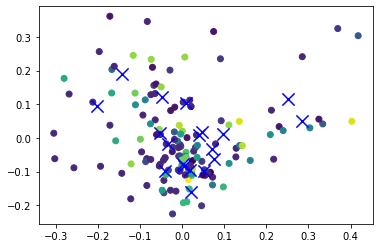
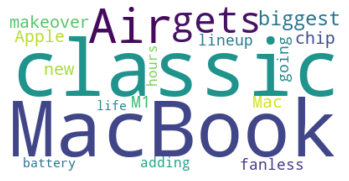
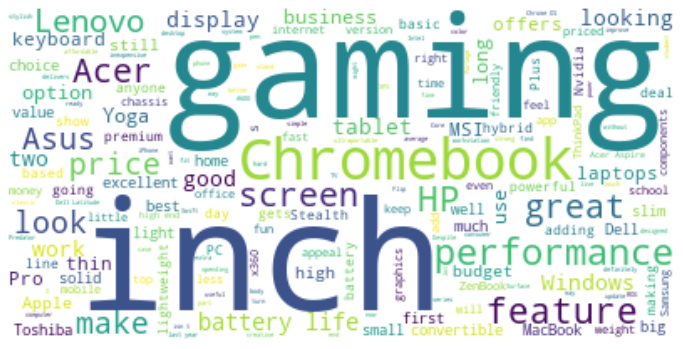
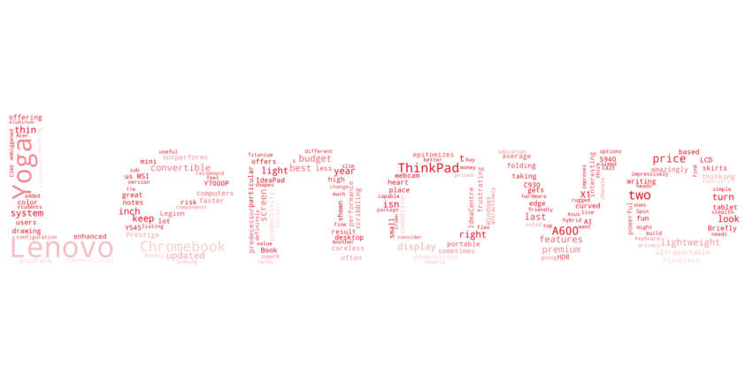
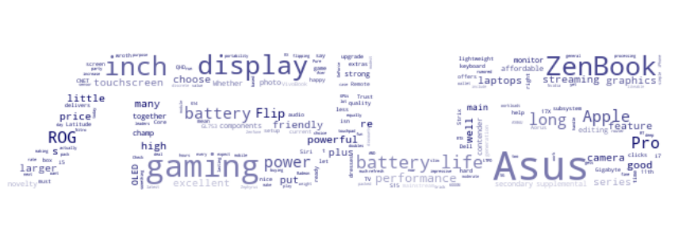

```python
import pandas as pd
import numpy as np
import re
```


```python
laptops = pd.read_csv('laptops.csv', encoding = "ISO-8859-1")
```


```python
companies = laptops['Company'].unique()
products = laptops['Product'].unique()
searches = laptops['Company'] + ' ' + laptops['Product']
searches = searches.str.replace(' ', '%20')
searches = searches.unique()
len(searches)
```


    620


```python
#Import the requests function and use it to download the page
import requests

#Import BeautifulSoup and use it on the downloaded page
from bs4 import BeautifulSoup
```


```python
query = "https://www.cnet.com/search?query="

#the loops
scrapes = []
queries = []

for i in range(len(searches)):
  review = []
  
  try:
      page = requests.get(query+searches[i])
      soup = BeautifulSoup(page.content, 'html.parser')
      review = soup.find_all('p', class_='dek')
      reviews = [r.get_text() for r in review]
      scrapes.append(reviews[0])
      queries.append(searches[i])
  except:
      pass

scrapes[0:20]
```


    ["The classic MacBook Air gets the biggest makeover in Apple's new M1 chip Mac lineup, going fanless and adding hours battery life.",
     "The classic MacBook Air gets the biggest makeover in Apple's new M1 chip Mac lineup, going fanless and adding hours battery life.",
     "A good mesh router will spread fast, reliable internet speeds throughout your entire home. These are the best we've tested.",
     'An inexpensive Windows laptop for undemanding tasks, the Acer Aspire 1 offers just enough to get the basics done.',
     'With an OLED main display and a supplemental monitor as well as powerful components, the Asus ZenBook Pro is a strong contender as a photo-editing champ.',
     'The Acer Swift 3 is a budget laptop with an impressive all-metal design, but it skimps on some features you might find important.',
     "The Dell Inspiron 27 7000 is a great looking update to the previous 2017 model. It's still a reasonable price for a student on a budget.",
     'Move over iPhone SE. This is the small iPhone people have been asking Apple to make.',
     'From its curved-edge HDR display to its AI-enhanced webcam to its amazingly small design, the Lenovo IdeaPad S940 epitomizes a premium ultraportable -- right down to its high price.',
     'Maintains its title as one of the best all-around general-purpose 13-inch Windows laptops you can buy.',
     "Whether you're into the novelty of having a secondary touchscreen or not, Asus has put together a good, affordable lightweight 15.6-inch laptop with the VivoBook S15.",
     "Like its predecessor, the Y7000P, Lenovo's Legion Y545 outperforms its price.",
     "The midsize SUV is a popular choice with buyers, but perhaps you're stumped on what you'd like. We can help.",
     "The Dell Inspiron 27 7000 is a great looking update to the previous 2017 model. It's still a reasonable price for a student on a budget.",
     "Microsoft has dominated the business-grade 'tablet-first' 2-in-1 market for a long time with its Surface Pro range, but Dell, along with Lenovo, is now providing strong competition.",
     "The classic MacBook Air gets the biggest makeover in Apple's new M1 chip Mac lineup, going fanless and adding hours battery life.",
     "The Dell Inspiron 27 7000 is a great looking update to the previous 2017 model. It's still a reasonable price for a student on a budget.",
     'The Dell Latitude 5285 is a Surface-style tablet in business attire. Its IT-ready security features may not appeal to consumers, but the clever pop-out kickstand will.',
     "The ProBook 6460B is all business, for better or for worse. Nobody's going to get overly excited by it, but as a workhorse it's certainly got some appeal.",
     "It's like a MacBook Air that runs Windows -- for half the price. (Even less, if you hit up a cash-back service.) Plus: a classic adventure game for free!"]


```python
#Should we want to review any of the HTML for the pages that we scraped...
# (this is what we used to find the object 'p' and class 'dek' for the reviews)

#print(soup.prettify())
```


```python
#Cleaning the results!

#Recombining the queries and scrapes from the for loop above
dict = {'Searches':queries,'Reviews':scrapes}

#Converting this recombination into a dataframe
df_reviews = pd.DataFrame(dict)

#Splitting the "searches" back into seperate Company and Product columns
df_reviews[['Company', 'Product']] = df_reviews['Searches'].str.split('%20', 1, expand=True)

#Now converting the %20 back into spaces in the Product column
df_reviews['Product'] = df_reviews['Product'].str.replace('%20', ' ')

#Dropping the searches column as we no longer need it
df_reviews = df_reviews.drop('Searches', 1)

#Re-ordering the dataframe
df_reviews = df_reviews[["Company", "Product", "Reviews"]]
```


<div>
<style scoped>
    .dataframe tbody tr th:only-of-type {
        vertical-align: middle;
    }

    .dataframe tbody tr th {
        vertical-align: top;
    }

    .dataframe thead th {
        text-align: right;
    }
</style>
<table border="1" class="dataframe">
  <thead>
    <tr style="text-align: right;">
      <th></th>
      <th>Searches</th>
      <th>Reviews</th>
    </tr>
  </thead>
  <tbody>
    <tr>
      <th>0</th>
      <td>Apple%20MacBook%20Pro</td>
      <td>The classic MacBook Air gets the biggest makeo...</td>
    </tr>
    <tr>
      <th>1</th>
      <td>Apple%20Macbook%20Air</td>
      <td>The classic MacBook Air gets the biggest makeo...</td>
    </tr>
    <tr>
      <th>2</th>
      <td>HP%20250%20G6</td>
      <td>A good mesh router will spread fast, reliable ...</td>
    </tr>
    <tr>
      <th>3</th>
      <td>Acer%20Aspire%203</td>
      <td>An inexpensive Windows laptop for undemanding ...</td>
    </tr>
    <tr>
      <th>4</th>
      <td>Asus%20ZenBook%20UX430UN</td>
      <td>With an OLED main display and a supplemental m...</td>
    </tr>
  </tbody>
</table>
</div>


```python
#Dropping duplicate reviews

#Duplicate reviews were the result of the duplication in our sample
#For instance, our sample contains many variations of the same laptop, e.g.
#  Lenovo V310-15ISK (i5-6200U/4GB/1TB/FHD/No
#  Lenovo V330-15IKB (i5-8250U/4GB/500GB/FHD/W10)
#  Lenovo V310-15ISK (i5-7200U/8GB/1TB
#  Lenovo V310-15IKB (i5-7200U/4GB/1TB/No

#CNET reviewed all of these laptops at once, hence there only being 1 unique review for these 4 searches

nodups = df_reviews.drop_duplicates(subset=['Reviews'])
len(nodups)
```


<div>
<style scoped>
    .dataframe tbody tr th:only-of-type {
        vertical-align: middle;
    }

    .dataframe tbody tr th {
        vertical-align: top;
    }

    .dataframe thead th {
        text-align: right;
    }
</style>
<table border="1" class="dataframe">
  <thead>
    <tr style="text-align: right;">
      <th></th>
      <th>Company</th>
      <th>Product</th>
      <th>Reviews</th>
    </tr>
  </thead>
  <tbody>
    <tr>
      <th>0</th>
      <td>Apple</td>
      <td>MacBook Pro</td>
      <td>The classic MacBook Air gets the biggest makeo...</td>
    </tr>
    <tr>
      <th>1</th>
      <td>Apple</td>
      <td>Macbook Air</td>
      <td>The classic MacBook Air gets the biggest makeo...</td>
    </tr>
    <tr>
      <th>2</th>
      <td>HP</td>
      <td>250 G6</td>
      <td>A good mesh router will spread fast, reliable ...</td>
    </tr>
    <tr>
      <th>3</th>
      <td>Acer</td>
      <td>Aspire 3</td>
      <td>An inexpensive Windows laptop for undemanding ...</td>
    </tr>
    <tr>
      <th>4</th>
      <td>Asus</td>
      <td>ZenBook UX430UN</td>
      <td>With an OLED main display and a supplemental m...</td>
    </tr>
  </tbody>
</table>
</div>


```python
#When we reviewed the data, we found one review for a car that made it in there that should not have
remove = nodups.loc[(nodups['Product'] == '255 G6')]
remove
```


<div>
<style scoped>
    .dataframe tbody tr th:only-of-type {
        vertical-align: middle;
    }

    .dataframe tbody tr th {
        vertical-align: top;
    }

    .dataframe thead th {
        text-align: right;
    }
</style>
<table border="1" class="dataframe">
  <thead>
    <tr style="text-align: right;">
      <th></th>
      <th>Company</th>
      <th>Product</th>
      <th>Reviews</th>
    </tr>
  </thead>
  <tbody>
    <tr>
      <th>11</th>
      <td>HP</td>
      <td>255 G6</td>
      <td>The midsize SUV is a popular choice with buyer...</td>
    </tr>
  </tbody>
</table>
</div>


```python
nodups = nodups.drop(labels=[11], axis=0)
len(nodups)
```


    141


```python
#We're down to just 141 reviews, but we promise this will still be interesting!

#We still have reviews from all 19 companies of laptops
len(nodups['Company'].unique())
```


    19


```python
#And as you can see, most of the duplicate reviews came from the most common companies
nodupcount = pd.DataFrame(nodups['Company'].value_counts())
nodupcount.columns = ['After_De-Duplication']

reviewcount = pd.DataFrame(df_reviews['Company'].value_counts())
reviewcount.columns = ['Before_De-Duplication']

counts = pd.concat([reviewcount, nodupcount], axis=1, join='inner')
counts
```


<div>
<style scoped>
    .dataframe tbody tr th:only-of-type {
        vertical-align: middle;
    }

    .dataframe tbody tr th {
        vertical-align: top;
    }

    .dataframe thead th {
        text-align: right;
    }
</style>
<table border="1" class="dataframe">
  <thead>
    <tr style="text-align: right;">
      <th></th>
      <th>Before_De-Duplication</th>
      <th>After_De-Duplication</th>
    </tr>
  </thead>
  <tbody>
    <tr>
      <th>Lenovo</th>
      <td>138</td>
      <td>16</td>
    </tr>
    <tr>
      <th>Asus</th>
      <td>127</td>
      <td>21</td>
    </tr>
    <tr>
      <th>HP</th>
      <td>121</td>
      <td>28</td>
    </tr>
    <tr>
      <th>Dell</th>
      <td>62</td>
      <td>10</td>
    </tr>
    <tr>
      <th>Acer</th>
      <td>55</td>
      <td>19</td>
    </tr>
    <tr>
      <th>MSI</th>
      <td>38</td>
      <td>13</td>
    </tr>
    <tr>
      <th>Toshiba</th>
      <td>36</td>
      <td>14</td>
    </tr>
    <tr>
      <th>Mediacom</th>
      <td>5</td>
      <td>4</td>
    </tr>
    <tr>
      <th>Apple</th>
      <td>4</td>
      <td>2</td>
    </tr>
    <tr>
      <th>Vero</th>
      <td>4</td>
      <td>2</td>
    </tr>
    <tr>
      <th>Samsung</th>
      <td>4</td>
      <td>4</td>
    </tr>
    <tr>
      <th>Chuwi</th>
      <td>3</td>
      <td>1</td>
    </tr>
    <tr>
      <th>Fujitsu</th>
      <td>3</td>
      <td>1</td>
    </tr>
    <tr>
      <th>LG</th>
      <td>3</td>
      <td>1</td>
    </tr>
    <tr>
      <th>Razer</th>
      <td>2</td>
      <td>2</td>
    </tr>
    <tr>
      <th>Microsoft</th>
      <td>1</td>
      <td>1</td>
    </tr>
    <tr>
      <th>Google</th>
      <td>1</td>
      <td>1</td>
    </tr>
    <tr>
      <th>Huawei</th>
      <td>1</td>
      <td>1</td>
    </tr>
    <tr>
      <th>Xiaomi</th>
      <td>1</td>
      <td>1</td>
    </tr>
  </tbody>
</table>
</div>


```python
#Picking up where we left off
import pandas as pd
import re
nodups = pd.read_csv('nodups.csv')
nodups = nodups.drop('Unnamed: 0', 1)
nodups.head()
```


<div>
<style scoped>
    .dataframe tbody tr th:only-of-type {
        vertical-align: middle;
    }

    .dataframe tbody tr th {
        vertical-align: top;
    }

    .dataframe thead th {
        text-align: right;
    }
</style>
<table border="1" class="dataframe">
  <thead>
    <tr style="text-align: right;">
      <th></th>
      <th>Company</th>
      <th>Product</th>
      <th>Reviews</th>
    </tr>
  </thead>
  <tbody>
    <tr>
      <th>0</th>
      <td>Apple</td>
      <td>MacBook Pro</td>
      <td>The classic MacBook Air gets the biggest makeo...</td>
    </tr>
    <tr>
      <th>1</th>
      <td>HP</td>
      <td>250 G6</td>
      <td>A good mesh router will spread fast, reliable ...</td>
    </tr>
    <tr>
      <th>2</th>
      <td>Acer</td>
      <td>Aspire 3</td>
      <td>An inexpensive Windows laptop for undemanding ...</td>
    </tr>
    <tr>
      <th>3</th>
      <td>Asus</td>
      <td>ZenBook UX430UN</td>
      <td>With an OLED main display and a supplemental m...</td>
    </tr>
    <tr>
      <th>4</th>
      <td>Acer</td>
      <td>Swift 3</td>
      <td>The Acer Swift 3 is a budget laptop with an im...</td>
    </tr>
  </tbody>
</table>
</div>


# NLP
Now that we have the reviews data from CNET, we can move forward with some Natural Langauge Processing (NLP)
NLP is a way to map words to vectors of real numbers.

### TF-IDF
Term-Frequency and Inverse Document Frequency (or TF-IDF) will allow us to consider the importance of a word across our review data. 

TF (Term Frequency) — the number of times a word appears in a review
IDF (Inverse Document Frequency) — the log to the base e of number of the total reviews  divided by the reviews in which the word appears.


```python
#TF-IDF
from sklearn.feature_extraction.text import TfidfVectorizer
```


```python
vectorizer = TfidfVectorizer()

#As an example, let's calculate the TF-IDF for each word in our Apple review...

vectors = vectorizer.fit_transform([nodups['Reviews'][0]])
feature_names = vectorizer.get_feature_names()
dense = vectors.todense()
denselist = dense.tolist()
df_dense = pd.DataFrame(denselist, columns=feature_names)
df_dense.head()
```


<div>
<style scoped>
    .dataframe tbody tr th:only-of-type {
        vertical-align: middle;
    }

    .dataframe tbody tr th {
        vertical-align: top;
    }

    .dataframe thead th {
        text-align: right;
    }
</style>
<table border="1" class="dataframe">
  <thead>
    <tr style="text-align: right;">
      <th></th>
      <th>are</th>
      <th>best</th>
      <th>entire</th>
      <th>fast</th>
      <th>good</th>
      <th>home</th>
      <th>internet</th>
      <th>mesh</th>
      <th>reliable</th>
      <th>router</th>
      <th>speeds</th>
      <th>spread</th>
      <th>tested</th>
      <th>the</th>
      <th>these</th>
      <th>throughout</th>
      <th>ve</th>
      <th>we</th>
      <th>will</th>
      <th>your</th>
    </tr>
  </thead>
  <tbody>
    <tr>
      <th>0</th>
      <td>0.223607</td>
      <td>0.223607</td>
      <td>0.223607</td>
      <td>0.223607</td>
      <td>0.223607</td>
      <td>0.223607</td>
      <td>0.223607</td>
      <td>0.223607</td>
      <td>0.223607</td>
      <td>0.223607</td>
      <td>0.223607</td>
      <td>0.223607</td>
      <td>0.223607</td>
      <td>0.223607</td>
      <td>0.223607</td>
      <td>0.223607</td>
      <td>0.223607</td>
      <td>0.223607</td>
      <td>0.223607</td>
      <td>0.223607</td>
    </tr>
  </tbody>
</table>
</div>


```python
#To help make our calculations be more accurate, we can remove some common words (such as 'the') from the reviews

#These are called stopwords, and includ the following...
from nltk.corpus import stopwords
stopwords.words('english')
```


```python
#Let's now create the vectors of all of our reviews, after removing the stopwords
vec = TfidfVectorizer(stop_words="english")
vec.fit(nodups.Reviews.values)
features = vec.transform(nodups.Reviews.values)
```


```python
#Now that we have these vectors, let's see if we can't predict company name from TF-IDF vectors
from sklearn.cluster import MiniBatchKMeans
random_state = 0 

#Let's go with 19 clusters since there were 19 companies
cls = MiniBatchKMeans(n_clusters=19, random_state=random_state)
cls.fit(features)
```


    MiniBatchKMeans(n_clusters=19, random_state=0)


```python
#Now we we can predict cluster labels
cls.predict(features)

#And to get cluster labels for the dataset used while training the model
cls.labels_
```


    array([15, 13,  3,  4,  2,  2,  4,  2,  2,  1,  9, 12, 12, 12,  2,  2,  2,
            2,  2,  1,  2, 18,  2,  7, 15, 15,  1,  2, 14,  6, 14,  3, 15,  2,
           13,  2,  1,  2,  3,  0,  7,  3,  2,  0,  2,  1,  2, 10,  2,  2,  2,
           10,  2,  2,  2,  2,  2, 16,  4,  3,  2, 12,  8,  2,  2, 12,  3,  8,
            2,  2,  2,  1, 18,  3,  2,  8,  3,  2, 17, 14, 10, 15,  5,  2,  2,
            1,  4,  3,  1,  3,  2,  8,  2,  9, 13,  5, 11,  2,  3,  8, 15,  2,
            1,  0,  2, 15,  2, 14,  2,  1,  2,  2, 10,  3,  7,  5,  2,  9,  3,
           10,  8, 16,  2,  9,  2, 11,  2, 17, 11,  3,  2, 16, 15,  1,  2,  1,
            2,  2,  2,  2,  3])


```python
#Let's use Principal Component Analysis (PCA) to reduce the dimensionality of these clusters

from sklearn.decomposition import PCA
pca = PCA(n_components=2, random_state=random_state)
reduced_features = pca.fit_transform(features.toarray())

#Now we can reduce the cluster centers' dimensionality
reduced_cluster_centers = pca.transform(cls.cluster_centers_)
```


```python
#Finally we can plot our results

import matplotlib.pyplot as plt
plt.scatter(reduced_features[:,0], reduced_features[:,1], c=cls.predict(features))
plt.scatter(reduced_cluster_centers[:, 0], reduced_cluster_centers[:,1], marker='x', s=150, c='b')
```


    <matplotlib.collections.PathCollection at 0x1c99051d640>


    

    


```python
#Let's see if our clustering model did a good job, using homogenity score, 
#where a score of 1 would denote a perfect prediction and a score of 0 would be terrible
from sklearn.metrics import homogeneity_score
homogeneity_score(nodups.Company, cls.predict(features))
```


    0.30233227609070984


```python
#So, not great

#Oddly enough, if we just used reviews from companies that have greater than 5 reviews...

#filtered = nodups.loc[(nodups['Company'] == 'Lenovo') | (nodups['Company'] == 'Asus') 
#                      | (nodups['Company'] == 'HP') | (nodups['Company'] == 'Dell')
#                      | (nodups['Company'] == 'Acer') | (nodups['Company'] == 'MSI')
#                      | (nodups['Company'] == 'Toshiba')]

#(7 companies, 121 observations)

#And performed all the same calculations as above, breaking into 7 clusters, 
#we actually end up with a lower homogenity score: #0.1562330422969558
```


```python
#Word Clouds
```


```python
pip install wordcloud
```

    Collecting wordcloud
      Downloading wordcloud-1.8.1-cp38-cp38-win_amd64.whl (155 kB)
    Requirement already satisfied: matplotlib in c:\users\bryan\anaconda3\lib\site-packages (from wordcloud) (3.3.4)
    Requirement already satisfied: pillow in c:\users\bryan\anaconda3\lib\site-packages (from wordcloud) (8.2.0)
    Requirement already satisfied: numpy>=1.6.1 in c:\users\bryan\anaconda3\lib\site-packages (from wordcloud) (1.20.1)
    Requirement already satisfied: cycler>=0.10 in c:\users\bryan\anaconda3\lib\site-packages (from matplotlib->wordcloud) (0.10.0)
    Requirement already satisfied: pyparsing!=2.0.4,!=2.1.2,!=2.1.6,>=2.0.3 in c:\users\bryan\anaconda3\lib\site-packages (from matplotlib->wordcloud) (2.4.7)
    Requirement already satisfied: kiwisolver>=1.0.1 in c:\users\bryan\anaconda3\lib\site-packages (from matplotlib->wordcloud) (1.3.1)
    Requirement already satisfied: python-dateutil>=2.1 in c:\users\bryan\anaconda3\lib\site-packages (from matplotlib->wordcloud) (2.8.1)
    Requirement already satisfied: six in c:\users\bryan\anaconda3\lib\site-packages (from cycler>=0.10->matplotlib->wordcloud) (1.15.0)
    Installing collected packages: wordcloud
    Successfully installed wordcloud-1.8.1
    Note: you may need to restart the kernel to use updated packages.
    


```python
from os import path
from PIL import Image
from wordcloud import WordCloud, STOPWORDS, ImageColorGenerator
```


```python
#As an example, let's start with a Wordcloud of our Apple review
#We know this review fairly well by now, but it doesn't help to print it again here.
#As we should recall from the TF-IDF from this review, there are no repeat words

text = nodups.Reviews[0]
text
```


    "The classic MacBook Air gets the biggest makeover in Apple's new M1 chip Mac lineup, going fanless and adding hours battery life."


```python
#There are two important defaults we should be mindful of:
#1. Since there are no repeated words, this will emphasize the MOST important words (using a ranking from a TF-IDF)
#2. This will also remove the same list of stopwords as before

wordcloud = WordCloud(background_color="white").generate(text)

plt.imshow(wordcloud, interpolation='bilinear')
plt.axis("off")
plt.show()
```


    

    


```python
#Out of curiosity, let's see what a WordCloud of ALL of our CNET reviews would look like
alltext = " ".join(review for review in nodups.Reviews)
print ("There are {} words in the combination of all reviews.".format(len(alltext)))
```

    There are 20018 words in the combination of all reviews.
    


```python
#The largest words here will be those most frequently used
wordcloud = WordCloud(stopwords=stopwords, background_color="white").generate(alltext)

plt.figure(figsize=(12,8))
plt.imshow(wordcloud, interpolation='bilinear')
plt.axis("off")
plt.show()
```


    

    


```python
#We can use this WordCloud as a tool for additional processing.
#For instance, we see some words that are not that helpful:

#We can add these to our list of stop words
stopwords = set(STOPWORDS)
stopwords.update(["laptop", "one", "new", "design", "need", "offer"])

wordcloud = WordCloud(stopwords=stopwords, background_color="white").generate(alltext)

plt.figure(figsize=(12,8))
plt.imshow(wordcloud, interpolation='bilinear')
plt.axis("off")
plt.show()
```


    

    


```python
#Much more specific!
#We can fine tune our results even moreso by creating WordClouds for each company
from PIL import Image
import numpy as np
from wordcloud import ImageColorGenerator
```


```python
#Lenovo

#Filter on just Lenovo reviews
lenovo = nodups.loc[(nodups['Company'] == 'Lenovo')]
lenovo_reviews = " ".join(review for review in lenovo.Reviews)

#Create Lenovo WordCloud in a fun shape
mask = np.array(Image.open('C:/Users/bryan/Desktop/Mining/FINAL/Lenovo.jpg'))
mask_colors = ImageColorGenerator(mask)

wc = WordCloud(stopwords=stopwords,
               mask=mask, background_color="white",
               max_words=2000, max_font_size=256,
               random_state=42, width=mask.shape[1],
               height=mask.shape[0], color_func=mask_colors)
wc.generate(lenovo_reviews)

plt.figure(figsize=(15,10))
plt.imshow(wc, interpolation="bilinear")
plt.axis('off')
plt.show()
```


    

    


```python
#Asus

asus = nodups.loc[(nodups['Company'] == 'Asus')]
asus_reviews = " ".join(review for review in asus.Reviews)

mask = np.array(Image.open('C:/Users/bryan/Desktop/Mining/FINAL/Asus.jpg'))

mask_colors = ImageColorGenerator(mask)

wc = WordCloud(stopwords=stopwords,
               mask=mask, background_color="white",
               max_words=2000, max_font_size=256,
               random_state=42, width=mask.shape[1],
               height=mask.shape[0], color_func=mask_colors)

wc.generate(asus_reviews)

plt.figure(figsize=(15,10))
plt.imshow(wc, interpolation="bilinear")
plt.axis('off')
plt.show()
```


    

    


```python
#HP

hp = nodups.loc[(nodups['Company'] == 'HP')]
hp_reviews = " ".join(review for review in hp.Reviews)

#Create Asus WordCloud in a fun shape

mask = np.array(Image.open('C:/Users/bryan/Desktop/Mining/FINAL/Hp.jpg'))

mask_colors = ImageColorGenerator(mask)

wc = WordCloud(stopwords=stopwords,
               mask=mask, background_color="white",
               max_words=2000, max_font_size=256,
               random_state=42, width=mask.shape[1],
               height=mask.shape[0], color_func=mask_colors)

wc.generate(hp_reviews)

plt.figure(figsize=(15,10))
plt.imshow(wc, interpolation="bilinear")
plt.axis('off')
plt.show()
```


    

    


```python
#Dell

dell = nodups.loc[(nodups['Company'] == 'Dell')]
dell_reviews = " ".join(review for review in dell.Reviews)

mask = np.array(Image.open('C:/Users/bryan/Desktop/Mining/FINAL/Dell.jpg'))

mask_colors = ImageColorGenerator(mask)

wc = WordCloud(stopwords=stopwords,
               mask=mask, background_color="white",
               max_words=2000, max_font_size=256,
               random_state=42, width=mask.shape[1],
               height=mask.shape[0], color_func=mask_colors)

wc.generate(dell_reviews)

plt.figure(figsize=(15,10))
plt.imshow(wc, interpolation="bilinear")
plt.axis('off')
plt.show()
```


    

    


```python
#Acer

acer = nodups.loc[(nodups['Company'] == 'Acer')]
acer_reviews = " ".join(review for review in acer.Reviews)

mask = np.array(Image.open('C:/Users/bryan/Desktop/Mining/FINAL/Acer.jpg'))

mask_colors = ImageColorGenerator(mask)

wc = WordCloud(stopwords=stopwords,
               mask=mask, background_color="white",
               max_words=2000, max_font_size=256,
               random_state=42, width=mask.shape[1],
               height=mask.shape[0], color_func=mask_colors)

wc.generate(acer_reviews)

plt.figure(figsize=(15,10))
plt.imshow(wc, interpolation="bilinear")
plt.axis('off')
plt.show()
```


    

    


```python
#MSI

msi = nodups.loc[(nodups['Company'] == 'MSI')]
msi_reviews = " ".join(review for review in msi.Reviews)

#Create Asus WordCloud in a fun shape

mask = np.array(Image.open('C:/Users/bryan/Desktop/Mining/FINAL/Msi.jpg'))

mask_colors = ImageColorGenerator(mask)

wc = WordCloud(stopwords=stopwords,
               mask=mask, background_color="white",
               max_words=2000, max_font_size=256,
               random_state=42, width=mask.shape[1],
               height=mask.shape[0], color_func=mask_colors)

wc.generate(msi_reviews)

plt.figure(figsize=(15,10))
plt.imshow(wc, interpolation="bilinear")
plt.axis('off')
plt.show()
```


    

    


```python
#Toshiba

toshiba = nodups.loc[(nodups['Company'] == 'Toshiba')]
toshiba_reviews = " ".join(review for review in toshiba.Reviews)

#Create Asus WordCloud in a fun shape

mask = np.array(Image.open('C:/Users/bryan/Desktop/Mining/FINAL/Toshiba.jpg'))

mask_colors = ImageColorGenerator(mask)

wc = WordCloud(stopwords=stopwords,
               mask=mask, background_color="white",
               max_words=2000, max_font_size=256,
               random_state=42, width=mask.shape[1],
               height=mask.shape[0], color_func=mask_colors)

wc.generate(toshiba_reviews)

plt.figure(figsize=(15,10))
plt.imshow(wc, interpolation="bilinear")
plt.axis('off')
plt.show()
```


    

    

