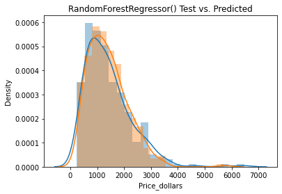
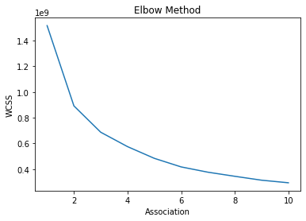
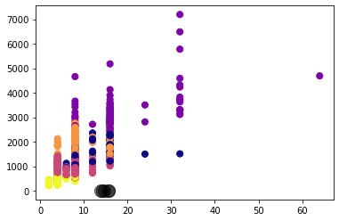
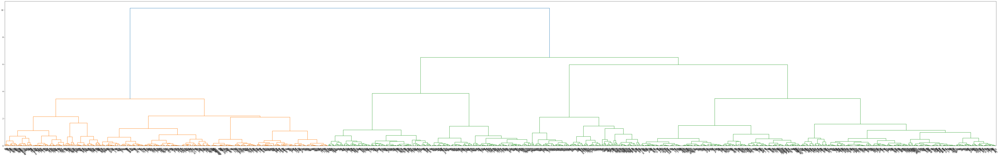

# Data Mining Project - Laptop Prices
Group Members:
    Adam Schuller
    Alessandro Joabar
    Bogdan Constantinescu
    Bryan Duff

### Importing necessary modules


```python
import pandas as pd
import numpy as np
pd.set_option("display.max_columns", None)

```

Importing Laptop data


```python
laptops = pd.read_csv('laptops.csv')
laptops.head()
```


<div>
<table border="1" class="dataframe">
  <thead>
    <tr style="text-align: right;">
      <th></th>
      <th>Unnamed: 0</th>
      <th>Company</th>
      <th>Product</th>
      <th>TypeName</th>
      <th>Inches</th>
      <th>ScreenResolution</th>
      <th>Cpu</th>
      <th>Ram</th>
      <th>Memory</th>
      <th>Gpu</th>
      <th>OpSys</th>
      <th>Weight</th>
      <th>Price_euros</th>
    </tr>
  </thead>
  <tbody>
    <tr>
      <th>0</th>
      <td>1</td>
      <td>Apple</td>
      <td>MacBook Pro</td>
      <td>Ultrabook</td>
      <td>13.3</td>
      <td>IPS Panel Retina Display 2560x1600</td>
      <td>Intel Core i5 2.3GHz</td>
      <td>8GB</td>
      <td>128GB SSD</td>
      <td>Intel Iris Plus Graphics 640</td>
      <td>macOS</td>
      <td>1.37kg</td>
      <td>1339.69</td>
    </tr>
    <tr>
      <th>1</th>
      <td>2</td>
      <td>Apple</td>
      <td>Macbook Air</td>
      <td>Ultrabook</td>
      <td>13.3</td>
      <td>1440x900</td>
      <td>Intel Core i5 1.8GHz</td>
      <td>8GB</td>
      <td>128GB Flash Storage</td>
      <td>Intel HD Graphics 6000</td>
      <td>macOS</td>
      <td>1.34kg</td>
      <td>898.94</td>
    </tr>
    <tr>
      <th>2</th>
      <td>3</td>
      <td>HP</td>
      <td>250 G6</td>
      <td>Notebook</td>
      <td>15.6</td>
      <td>Full HD 1920x1080</td>
      <td>Intel Core i5 7200U 2.5GHz</td>
      <td>8GB</td>
      <td>256GB SSD</td>
      <td>Intel HD Graphics 620</td>
      <td>No OS</td>
      <td>1.86kg</td>
      <td>575.00</td>
    </tr>
    <tr>
      <th>3</th>
      <td>4</td>
      <td>Apple</td>
      <td>MacBook Pro</td>
      <td>Ultrabook</td>
      <td>15.4</td>
      <td>IPS Panel Retina Display 2880x1800</td>
      <td>Intel Core i7 2.7GHz</td>
      <td>16GB</td>
      <td>512GB SSD</td>
      <td>AMD Radeon Pro 455</td>
      <td>macOS</td>
      <td>1.83kg</td>
      <td>2537.45</td>
    </tr>
    <tr>
      <th>4</th>
      <td>5</td>
      <td>Apple</td>
      <td>MacBook Pro</td>
      <td>Ultrabook</td>
      <td>13.3</td>
      <td>IPS Panel Retina Display 2560x1600</td>
      <td>Intel Core i5 3.1GHz</td>
      <td>8GB</td>
      <td>256GB SSD</td>
      <td>Intel Iris Plus Graphics 650</td>
      <td>macOS</td>
      <td>1.37kg</td>
      <td>1803.60</td>
    </tr>
  </tbody>
</table>
</div>


Importing GPU data


```python
gpu = pd.read_csv('GPU_ranks.csv')
gpu = gpu.drop(columns=['Unnamed: 5', 'Unnamed: 6'])
gpu.head()
```


<div>
<table border="1" class="dataframe">
  <thead>
    <tr style="text-align: right;">
      <th></th>
      <th>Videocard Name</th>
      <th>Passmark G3D Mark</th>
      <th>Rank</th>
      <th>Videocard Value</th>
      <th>usd</th>
    </tr>
  </thead>
  <tbody>
    <tr>
      <th>0</th>
      <td>Radeon RX 6900 XT</td>
      <td>26603</td>
      <td>1</td>
      <td>15.65</td>
      <td>1699.98</td>
    </tr>
    <tr>
      <th>1</th>
      <td>GeForce RTX 3080 Ti</td>
      <td>26477</td>
      <td>2</td>
      <td>14.96</td>
      <td>$1,769.99*</td>
    </tr>
    <tr>
      <th>2</th>
      <td>GeForce RTX 3090</td>
      <td>25845</td>
      <td>3</td>
      <td>8.07</td>
      <td>$3,202.99*</td>
    </tr>
    <tr>
      <th>3</th>
      <td>GeForce RTX 3080</td>
      <td>24408</td>
      <td>4</td>
      <td>5.55</td>
      <td>$4,399.99*</td>
    </tr>
    <tr>
      <th>4</th>
      <td>RTX A5000</td>
      <td>24150</td>
      <td>5</td>
      <td>NaN</td>
      <td>NaN</td>
    </tr>
  </tbody>
</table>
</div>


Importing CPU data


```python
cpu = pd.read_csv('CPU Ranks.csv')
cpu.head(50)
```


<div>
<table border="1" class="dataframe">
  <thead>
    <tr style="text-align: right;">
      <th></th>
      <th>CPU Name</th>
      <th>CPU Mark (Higher is better)</th>
      <th>Rank (Lower is better)</th>
      <th>CPU Value (Higher is better)</th>
      <th>Price (USD)</th>
    </tr>
  </thead>
  <tbody>
    <tr>
      <th>0</th>
      <td>AMD EPYC 7763</td>
      <td>87,767</td>
      <td>1</td>
      <td>NaN</td>
      <td>NaN</td>
    </tr>
    <tr>
      <th>1</th>
      <td>AMD EPYC 7713</td>
      <td>85,859</td>
      <td>2</td>
      <td>NaN</td>
      <td>NaN</td>
    </tr>
    <tr>
      <th>2</th>
      <td>AMD EPYC 7J13</td>
      <td>85,696</td>
      <td>3</td>
      <td>NaN</td>
      <td>NaN</td>
    </tr>
    <tr>
      <th>3</th>
      <td>AMD Ryzen Threadripper PRO 3995WX</td>
      <td>85,506</td>
      <td>4</td>
      <td>15.59</td>
      <td>$5,484.99</td>
    </tr>
    <tr>
      <th>4</th>
      <td>AMD Ryzen Threadripper 3990X</td>
      <td>81,261</td>
      <td>5</td>
      <td>19.25</td>
      <td>$4,222.22*</td>
    </tr>
    <tr>
      <th>5</th>
      <td>AMD EPYC 7643</td>
      <td>77,101</td>
      <td>6</td>
      <td>NaN</td>
      <td>NaN</td>
    </tr>
    <tr>
      <th>6</th>
      <td>AMD EPYC 7702</td>
      <td>71,686</td>
      <td>7</td>
      <td>8.43</td>
      <td>$8,499.00</td>
    </tr>
    <tr>
      <th>7</th>
      <td>AMD EPYC 7662</td>
      <td>71,576</td>
      <td>8</td>
      <td>13.50</td>
      <td>$5,300.00*</td>
    </tr>
    <tr>
      <th>8</th>
      <td>AMD Ryzen Threadripper 3970X</td>
      <td>64,107</td>
      <td>9</td>
      <td>25.54</td>
      <td>$2,510.20</td>
    </tr>
    <tr>
      <th>9</th>
      <td>AMD EPYC 7742</td>
      <td>64,071</td>
      <td>10</td>
      <td>8.05</td>
      <td>$7,961.00</td>
    </tr>
    <tr>
      <th>10</th>
      <td>AMD EPYC 7R32</td>
      <td>63,037</td>
      <td>11</td>
      <td>NaN</td>
      <td>NaN</td>
    </tr>
    <tr>
      <th>11</th>
      <td>AMD Ryzen Threadripper PRO 3975WX</td>
      <td>62,877</td>
      <td>12</td>
      <td>23.30</td>
      <td>$2,698.99</td>
    </tr>
    <tr>
      <th>12</th>
      <td>AMD EPYC 7513</td>
      <td>59,309</td>
      <td>13</td>
      <td>20.88</td>
      <td>$2,840.00*</td>
    </tr>
    <tr>
      <th>13</th>
      <td>AMD EPYC 7702P</td>
      <td>58,119</td>
      <td>14</td>
      <td>12.50</td>
      <td>$4,650.00*</td>
    </tr>
    <tr>
      <th>14</th>
      <td>AMD EPYC 7443P</td>
      <td>58,049</td>
      <td>15</td>
      <td>43.42</td>
      <td>$1,337.00*</td>
    </tr>
    <tr>
      <th>15</th>
      <td>AMD EPYC 7542</td>
      <td>56,809</td>
      <td>16</td>
      <td>13.43</td>
      <td>$4,230.55</td>
    </tr>
    <tr>
      <th>16</th>
      <td>AMD Ryzen Threadripper 3960X</td>
      <td>54,998</td>
      <td>17</td>
      <td>39.28</td>
      <td>$1,399.99</td>
    </tr>
    <tr>
      <th>17</th>
      <td>AMD EPYC 7502</td>
      <td>53,591</td>
      <td>18</td>
      <td>17.72</td>
      <td>$3,025.00</td>
    </tr>
    <tr>
      <th>18</th>
      <td>AMD EPYC 7413</td>
      <td>47,603</td>
      <td>19</td>
      <td>NaN</td>
      <td>NaN</td>
    </tr>
    <tr>
      <th>19</th>
      <td>AMD EPYC 7502P</td>
      <td>47,070</td>
      <td>20</td>
      <td>13.20</td>
      <td>$3,565.40*</td>
    </tr>
    <tr>
      <th>20</th>
      <td>AMD Ryzen 9 5950X</td>
      <td>46,137</td>
      <td>21</td>
      <td>57.38</td>
      <td>$804.00</td>
    </tr>
    <tr>
      <th>21</th>
      <td>AMD EPYC 7343</td>
      <td>45,882</td>
      <td>22</td>
      <td>29.32</td>
      <td>$1,565.00*</td>
    </tr>
    <tr>
      <th>22</th>
      <td>AMD EPYC 7402</td>
      <td>45,684</td>
      <td>23</td>
      <td>23.01</td>
      <td>$1,984.99</td>
    </tr>
    <tr>
      <th>23</th>
      <td>AMD EPYC 7452</td>
      <td>42,149</td>
      <td>24</td>
      <td>7.03</td>
      <td>$5,995.95*</td>
    </tr>
    <tr>
      <th>24</th>
      <td>Intel Xeon W-3275M @ 2.50GHz</td>
      <td>41,412</td>
      <td>25</td>
      <td>5.56</td>
      <td>$7,453.00*</td>
    </tr>
    <tr>
      <th>25</th>
      <td>AMD EPYC 7402P</td>
      <td>40,754</td>
      <td>26</td>
      <td>28.38</td>
      <td>$1,435.99</td>
    </tr>
    <tr>
      <th>26</th>
      <td>AMD EPYC 7F52</td>
      <td>40,468</td>
      <td>27</td>
      <td>13.05</td>
      <td>$3,100.00*</td>
    </tr>
    <tr>
      <th>27</th>
      <td>AMD Ryzen Threadripper PRO 3955WX</td>
      <td>40,226</td>
      <td>28</td>
      <td>35.01</td>
      <td>$1,148.99</td>
    </tr>
    <tr>
      <th>28</th>
      <td>AMD EPYC 7313P</td>
      <td>39,993</td>
      <td>29</td>
      <td>43.80</td>
      <td>$913.00*</td>
    </tr>
    <tr>
      <th>29</th>
      <td>AMD Ryzen 9 5900X</td>
      <td>39,545</td>
      <td>30</td>
      <td>69.38</td>
      <td>$569.99</td>
    </tr>
    <tr>
      <th>30</th>
      <td>AMD Ryzen 9 3950X</td>
      <td>39,197</td>
      <td>31</td>
      <td>30.38</td>
      <td>$1,290.04</td>
    </tr>
    <tr>
      <th>31</th>
      <td>Intel Xeon Gold 6248R @ 3.00GHz</td>
      <td>38,521</td>
      <td>32</td>
      <td>14.06</td>
      <td>$2,740.00*</td>
    </tr>
    <tr>
      <th>32</th>
      <td>Intel Xeon Platinum 8280 @ 2.70GHz</td>
      <td>37,575</td>
      <td>33</td>
      <td>4.07</td>
      <td>$9,242.00*</td>
    </tr>
    <tr>
      <th>33</th>
      <td>Intel Xeon W-3175X @ 3.10GHz</td>
      <td>36,360</td>
      <td>34</td>
      <td>11.63</td>
      <td>$3,126.99</td>
    </tr>
    <tr>
      <th>34</th>
      <td>AMD Ryzen 9 5900</td>
      <td>35,598</td>
      <td>35</td>
      <td>NaN</td>
      <td>NaN</td>
    </tr>
    <tr>
      <th>35</th>
      <td>Intel Xeon Gold 6242R @ 3.10GHz</td>
      <td>35,505</td>
      <td>36</td>
      <td>13.71</td>
      <td>$2,589.00*</td>
    </tr>
    <tr>
      <th>36</th>
      <td>Intel Xeon Platinum 8260M @ 2.30GHz</td>
      <td>33,970</td>
      <td>37</td>
      <td>4.41</td>
      <td>$7,705.00*</td>
    </tr>
    <tr>
      <th>37</th>
      <td>Intel Core i9-10980XE @ 3.00GHz</td>
      <td>33,871</td>
      <td>38</td>
      <td>34.21</td>
      <td>$989.99</td>
    </tr>
    <tr>
      <th>38</th>
      <td>AMD Ryzen Threadripper PRO 3945WX</td>
      <td>33,849</td>
      <td>39</td>
      <td>NaN</td>
      <td>NaN</td>
    </tr>
    <tr>
      <th>39</th>
      <td>Intel Xeon Platinum 8168 @ 2.70GHz</td>
      <td>33,503</td>
      <td>40</td>
      <td>5.69</td>
      <td>$5,890.00*</td>
    </tr>
    <tr>
      <th>40</th>
      <td>AMD EPYC 73F3</td>
      <td>33,124</td>
      <td>41</td>
      <td>9.41</td>
      <td>$3,521.00*</td>
    </tr>
    <tr>
      <th>41</th>
      <td>AMD Ryzen 9 3900XT</td>
      <td>32,927</td>
      <td>42</td>
      <td>47.52</td>
      <td>$692.88</td>
    </tr>
    <tr>
      <th>42</th>
      <td>AMD Ryzen 9 3900X</td>
      <td>32,875</td>
      <td>43</td>
      <td>53.46</td>
      <td>$614.99</td>
    </tr>
    <tr>
      <th>43</th>
      <td>AMD EPYC 7302P</td>
      <td>32,480</td>
      <td>44</td>
      <td>23.20</td>
      <td>$1,399.95*</td>
    </tr>
    <tr>
      <th>44</th>
      <td>Intel Core i9-9980XE @ 3.00GHz</td>
      <td>32,424</td>
      <td>45</td>
      <td>27.71</td>
      <td>$1,169.99*</td>
    </tr>
    <tr>
      <th>45</th>
      <td>Intel Xeon Gold 6252 @ 2.10GHz</td>
      <td>32,410</td>
      <td>46</td>
      <td>8.08</td>
      <td>$4,008.99</td>
    </tr>
    <tr>
      <th>46</th>
      <td>AMD Ryzen Threadripper 2990WX</td>
      <td>32,260</td>
      <td>47</td>
      <td>17.97</td>
      <td>$1,795.27</td>
    </tr>
    <tr>
      <th>47</th>
      <td>AMD EPYC 7302</td>
      <td>32,198</td>
      <td>48</td>
      <td>22.36</td>
      <td>$1,440.00*</td>
    </tr>
    <tr>
      <th>48</th>
      <td>Intel Xeon Gold 6230R @ 2.10GHz</td>
      <td>32,113</td>
      <td>49</td>
      <td>16.95</td>
      <td>$1,894.00*</td>
    </tr>
    <tr>
      <th>49</th>
      <td>Intel Xeon W-2295 @ 3.00GHz</td>
      <td>31,594</td>
      <td>50</td>
      <td>23.70</td>
      <td>$1,333.00*</td>
    </tr>
  </tbody>
</table>
</div>


## Cleaning all three sets of data

### Cleaning Laptop dataset

1. RAM
 - Removed string ‘GB’
 - Converted to numeric type
2. Weight
- Removed string ‘kg’
- Converted to numeric type
3. Price_dollars
- Converted from euros to USD
- Removed Price_euros


```python
laptops['Ram'] = [pd.to_numeric(str(laptops['Ram'].iloc[x]).replace('GB','')) for x in range(len(laptops['Ram']))]
laptops['Weight'] = [pd.to_numeric(str(laptops['Ram'].iloc[x]).replace('kg','')) for x in range(len(laptops['Ram']))]
laptops['Price_dollars'] = round(laptops['Price_euros']*1.18,2)
laptops = laptops.drop('Price_euros',axis=1)
```


```python
laptops['OpSys'].value_counts()
```


    Windows 10      1072
    No OS             66
    Linux             62
    Windows 7         45
    Chrome OS         27
    macOS             13
    Windows 10 S       8
    Mac OS X           8
    Android            2
    Name: OpSys, dtype: int64


66 values have 'No OS' for it's operating system. We checked some of the laptop models that had 'No OS' specified, and from our research it seemed like a majority of these laptops did not actually come with an operating system installed. For example, when shopping for a Lenovo Thinkpad the user can decide whether they want to have Windows 10 or Chrome OS installed. Therefor
e, 'No OS' was a customization feature and we decided to keep this operating system category.

For Linux OS, only some computers come pre-installed with Linux. Others with Linux as their listed OS are only Linux compatible. Therefore, we searched the product name to see if it had 'Linux' in it. If it did, then we kept Linux as the operating system. If it didn't, we converted it to Windows 10.


```python
laptops['OpSys'].value_counts()
```


    Windows 10      1072
    No OS             66
    Linux             62
    Windows 7         45
    Chrome OS         27
    macOS             13
    Windows 10 S       8
    Mac OS X           8
    Android            2
    Name: OpSys, dtype: int64


Converted OpSys to ‘Windows 10’ if product name did not mention Linux. This was because computers were listed as Linux compatible, but did not necessarily have Linux pre-installed


```python
laptops['OpSys'] = ['Windows 10' if laptops['OpSys'].iloc[x] == 'Linux' and 'Linux' not in laptops['Product'].iloc[x] else laptops['OpSys'].iloc[x] for x in range(len(laptops['OpSys']))]
```

Converted ‘Windows 10 S’ to ‘Windows 10’


```python
laptops['OpSys'] = ['Windows 10' if laptops['OpSys'].iloc[x] == 'Windows 10 S' else laptops['OpSys'].iloc[x] for x in range(len(laptops['OpSys']))]
```


```python
laptops['OpSys'].value_counts()
```


    Windows 10    1137
    No OS           66
    Windows 7       45
    Chrome OS       27
    macOS           13
    Mac OS X         8
    Linux            5
    Android          2
    Name: OpSys, dtype: int64


Created dummy variables


```python
df = pd.get_dummies(laptops['OpSys'])
```

Dropped ‘OpSys’ column


```python
laptops = laptops.drop('OpSys',axis=1)
```

Merged dummy variables into laptops dataset


```python
laptops = pd.concat([laptops, df], axis=1, join='inner')
```

Memory
- Removed string 'Flash Storage' in lieu of 'SSD'
- Split memory entries that have + into two strings (The + indiciated two harddrives)
- Created four new feature columns, 'Memory', 'Hybrid', 'SSD', 'HDD'
- 1 for Hybrid if memory has an SSD and HDD drive
- 1 for SSD if memory only contains SSD and 0 for Hybrid
- 1 for HDD if memory only contains HDD and 0 for Hybrid


```python
laptops['Memory'] = [(laptops['Memory'].iloc[x]).replace(' Flash Storage',' SSD') for x in range(len(laptops['Memory']))]
```


```python
laptops['Hybrid'] = [1 if 'Hybrid' in laptops['Memory'].iloc[x] or 'HDD' in laptops['Memory'].iloc[x] and 'SSD' in laptops['Memory'] else 0 for x in range(len(laptops['Memory']))]
```


```python
laptops['SSD'] = [1 if 'SSD' in laptops['Memory'].iloc[x] and laptops['Hybrid'].iloc[x] != 1 else 0 for x in range(len(laptops['Memory']))]
```


```python
laptops['HDD'] = [1 if 'HDD' in laptops['Memory'].iloc[x] and laptops['Hybrid'].iloc[x] != 1 else 0 for x in range(len(laptops['Memory']))]
```

Split Memory into two temporary columns:
- Memory 1 for harddrive 1 of 1 or harddrive 1 of 1
- Memory 2 for harddrive 2 of 2 or 0 if no second harddrive


```python
laptops['Memory1'] = 0
laptops['Memory2'] = 0
```


```python
for x in range(len(laptops['Memory'])):
    if '+' in laptops['Memory'].iloc[x]:
        split_string = laptops['Memory'].iloc[x].split("+",)
        if len(split_string) == 1:
            laptops['Memory1'].iloc[x] = split_string[0]
            laptops['Memory2'].iloc[x] = 0
        if len(split_string) == 2:
            laptops['Memory1'].iloc[x] = split_string[0]
            laptops['Memory2'].iloc[x] = split_string[1]
    else:
        laptops['Memory1'].iloc[x] = laptops['Memory'].iloc[x]
        laptops['Memory2'].iloc[x] = 0
```

    /Users/adam/opt/anaconda3/lib/python3.8/site-packages/pandas/core/indexing.py:1637: SettingWithCopyWarning: 
    A value is trying to be set on a copy of a slice from a DataFrame
    
    See the caveats in the documentation: https://pandas.pydata.org/pandas-docs/stable/user_guide/indexing.html#returning-a-view-versus-a-copy
      self._setitem_single_block(indexer, value, name)


Formatted both Memory1 and Memory2 to numeric values. '1TB' and '1.0TB' were replaced with 1000.


```python
laptops['Memory1'] = [pd.to_numeric(str(laptops['Memory1'].iloc[x]).replace('GB','').replace(' ','').replace('1.0TB','1000').replace('1TB','1000').replace('SSD','').replace('HDD',''),errors = 'coerce') for x in range(len(laptops['Memory1']))]
```


```python
laptops['Memory2'] = [pd.to_numeric(str(laptops['Memory2'].iloc[x]).replace('GB','').replace(' ','').replace('1.0TB','1000').replace('1TB','1000').replace('SSD','').replace('HDD',''),errors = 'coerce') for x in range(len(laptops['Memory2']))]
```


```python
laptops['Memory1'].value_counts()
```


    256.0     508
    1000.0    241
    128.0     177
    512.0     140
    500.0     132
    32.0       45
    64.0       17
    16.0       10
    180.0       5
    8.0         1
    240.0       1
    Name: Memory1, dtype: int64


```python
laptops['Memory2'].value_counts()
```


    0.0       1095
    1000.0     185
    256.0        3
    500.0        2
    512.0        1
    Name: Memory2, dtype: int64


Converted original Memory feature to sum of both Memory1 and Memory2 to achieve total harddrive space.


```python
laptops['Memory'] = laptops['Memory1'] + laptops['Memory2']
```

Dropped temporary Memory1 and Memory2 features.


```python
laptops = laptops.drop('Memory1',axis=1)
laptops = laptops.drop('Memory2',axis=1)
```


```python
laptops.head()
```


<div>
<table border="1" class="dataframe">
  <thead>
    <tr style="text-align: right;">
      <th></th>
      <th>Unnamed: 0</th>
      <th>Company</th>
      <th>Product</th>
      <th>TypeName</th>
      <th>Inches</th>
      <th>ScreenResolution</th>
      <th>Cpu</th>
      <th>Ram</th>
      <th>Memory</th>
      <th>Gpu</th>
      <th>Weight</th>
      <th>Price_dollars</th>
      <th>Android</th>
      <th>Chrome OS</th>
      <th>Linux</th>
      <th>Mac OS X</th>
      <th>No OS</th>
      <th>Windows 10</th>
      <th>Windows 7</th>
      <th>macOS</th>
      <th>Hybrid</th>
      <th>SSD</th>
      <th>HDD</th>
    </tr>
  </thead>
  <tbody>
    <tr>
      <th>0</th>
      <td>1</td>
      <td>Apple</td>
      <td>MacBook Pro</td>
      <td>Ultrabook</td>
      <td>13.3</td>
      <td>IPS Panel Retina Display 2560x1600</td>
      <td>Intel Core i5 2.3GHz</td>
      <td>8</td>
      <td>128.0</td>
      <td>Intel Iris Plus Graphics 640</td>
      <td>8</td>
      <td>1580.83</td>
      <td>0</td>
      <td>0</td>
      <td>0</td>
      <td>0</td>
      <td>0</td>
      <td>0</td>
      <td>0</td>
      <td>1</td>
      <td>0</td>
      <td>1</td>
      <td>0</td>
    </tr>
    <tr>
      <th>1</th>
      <td>2</td>
      <td>Apple</td>
      <td>Macbook Air</td>
      <td>Ultrabook</td>
      <td>13.3</td>
      <td>1440x900</td>
      <td>Intel Core i5 1.8GHz</td>
      <td>8</td>
      <td>128.0</td>
      <td>Intel HD Graphics 6000</td>
      <td>8</td>
      <td>1060.75</td>
      <td>0</td>
      <td>0</td>
      <td>0</td>
      <td>0</td>
      <td>0</td>
      <td>0</td>
      <td>0</td>
      <td>1</td>
      <td>0</td>
      <td>1</td>
      <td>0</td>
    </tr>
    <tr>
      <th>2</th>
      <td>3</td>
      <td>HP</td>
      <td>250 G6</td>
      <td>Notebook</td>
      <td>15.6</td>
      <td>Full HD 1920x1080</td>
      <td>Intel Core i5 7200U 2.5GHz</td>
      <td>8</td>
      <td>256.0</td>
      <td>Intel HD Graphics 620</td>
      <td>8</td>
      <td>678.50</td>
      <td>0</td>
      <td>0</td>
      <td>0</td>
      <td>0</td>
      <td>1</td>
      <td>0</td>
      <td>0</td>
      <td>0</td>
      <td>0</td>
      <td>1</td>
      <td>0</td>
    </tr>
    <tr>
      <th>3</th>
      <td>4</td>
      <td>Apple</td>
      <td>MacBook Pro</td>
      <td>Ultrabook</td>
      <td>15.4</td>
      <td>IPS Panel Retina Display 2880x1800</td>
      <td>Intel Core i7 2.7GHz</td>
      <td>16</td>
      <td>512.0</td>
      <td>AMD Radeon Pro 455</td>
      <td>16</td>
      <td>2994.19</td>
      <td>0</td>
      <td>0</td>
      <td>0</td>
      <td>0</td>
      <td>0</td>
      <td>0</td>
      <td>0</td>
      <td>1</td>
      <td>0</td>
      <td>1</td>
      <td>0</td>
    </tr>
    <tr>
      <th>4</th>
      <td>5</td>
      <td>Apple</td>
      <td>MacBook Pro</td>
      <td>Ultrabook</td>
      <td>13.3</td>
      <td>IPS Panel Retina Display 2560x1600</td>
      <td>Intel Core i5 3.1GHz</td>
      <td>8</td>
      <td>256.0</td>
      <td>Intel Iris Plus Graphics 650</td>
      <td>8</td>
      <td>2128.25</td>
      <td>0</td>
      <td>0</td>
      <td>0</td>
      <td>0</td>
      <td>0</td>
      <td>0</td>
      <td>0</td>
      <td>1</td>
      <td>0</td>
      <td>1</td>
      <td>0</td>
    </tr>
  </tbody>
</table>
</div>


### Cleaning GPU dataset


```python
gpu.head()
```


<div>
<table border="1" class="dataframe">
  <thead>
    <tr style="text-align: right;">
      <th></th>
      <th>Videocard Name</th>
      <th>Passmark G3D Mark</th>
      <th>Rank</th>
      <th>Videocard Value</th>
      <th>usd</th>
    </tr>
  </thead>
  <tbody>
    <tr>
      <th>0</th>
      <td>Radeon RX 6900 XT</td>
      <td>26603</td>
      <td>1</td>
      <td>15.65</td>
      <td>1699.98</td>
    </tr>
    <tr>
      <th>1</th>
      <td>GeForce RTX 3080 Ti</td>
      <td>26477</td>
      <td>2</td>
      <td>14.96</td>
      <td>$1,769.99*</td>
    </tr>
    <tr>
      <th>2</th>
      <td>GeForce RTX 3090</td>
      <td>25845</td>
      <td>3</td>
      <td>8.07</td>
      <td>$3,202.99*</td>
    </tr>
    <tr>
      <th>3</th>
      <td>GeForce RTX 3080</td>
      <td>24408</td>
      <td>4</td>
      <td>5.55</td>
      <td>$4,399.99*</td>
    </tr>
    <tr>
      <th>4</th>
      <td>RTX A5000</td>
      <td>24150</td>
      <td>5</td>
      <td>NaN</td>
      <td>NaN</td>
    </tr>
  </tbody>
</table>
</div>


```python
gpu.info()
```

    <class 'pandas.core.frame.DataFrame'>
    RangeIndex: 2361 entries, 0 to 2360
    Data columns (total 5 columns):
     #   Column             Non-Null Count  Dtype 
    ---  ------             --------------  ----- 
     0   Videocard Name     2313 non-null   object
     1   Passmark G3D Mark  2320 non-null   object
     2   Rank               2320 non-null   object
     3   Videocard Value    611 non-null    object
     4   usd                611 non-null    object
    dtypes: object(5)
    memory usage: 92.4+ KB


Cleaned GPU data, converting object types to integers.


```python
gpu = gpu[(gpu['Videocard Name'] != 'Videocard Name')]
gpu.dropna(subset=['Videocard Name'], inplace = True)

gpu['Passmark G3D Mark'] = pd.to_numeric(gpu['Passmark G3D Mark'])
gpu['Rank'] = [pd.to_numeric(str(gpu['Rank'].iloc[x])) if gpu['Rank'].iloc[x] == gpu['Rank'].iloc[x] else np.nan for x in range(len(gpu['Rank']))]
gpu['Videocard Value'] = [pd.to_numeric(str(gpu['Videocard Value'].iloc[x])) if gpu['Videocard Value'].iloc[x] == gpu['Videocard Value'].iloc[x] else np.nan for x in range(len(gpu['Videocard Value']))]
gpu['usd'] = [pd.to_numeric(str(gpu['usd'].iloc[x]).replace('$','').replace('*','').replace(',','').replace('Price','').replace('(USD)','')) if gpu['usd'].iloc[x] == gpu['usd'].iloc[x] else np.nan for x in range(len(gpu['usd']))]
```


```python
gpu.head()
```


<div>
<table border="1" class="dataframe">
  <thead>
    <tr style="text-align: right;">
      <th></th>
      <th>Videocard Name</th>
      <th>Passmark G3D Mark</th>
      <th>Rank</th>
      <th>Videocard Value</th>
      <th>usd</th>
    </tr>
  </thead>
  <tbody>
    <tr>
      <th>0</th>
      <td>Radeon RX 6900 XT</td>
      <td>26603.0</td>
      <td>1.0</td>
      <td>15.65</td>
      <td>1699.98</td>
    </tr>
    <tr>
      <th>1</th>
      <td>GeForce RTX 3080 Ti</td>
      <td>26477.0</td>
      <td>2.0</td>
      <td>14.96</td>
      <td>1769.99</td>
    </tr>
    <tr>
      <th>2</th>
      <td>GeForce RTX 3090</td>
      <td>25845.0</td>
      <td>3.0</td>
      <td>8.07</td>
      <td>3202.99</td>
    </tr>
    <tr>
      <th>3</th>
      <td>GeForce RTX 3080</td>
      <td>24408.0</td>
      <td>4.0</td>
      <td>5.55</td>
      <td>4399.99</td>
    </tr>
    <tr>
      <th>4</th>
      <td>RTX A5000</td>
      <td>24150.0</td>
      <td>5.0</td>
      <td>NaN</td>
      <td>NaN</td>
    </tr>
  </tbody>
</table>
</div>


```python
gpu.info()
```

    <class 'pandas.core.frame.DataFrame'>
    Int64Index: 2268 entries, 0 to 2360
    Data columns (total 5 columns):
     #   Column             Non-Null Count  Dtype  
    ---  ------             --------------  -----  
     0   Videocard Name     2268 non-null   object 
     1   Passmark G3D Mark  2230 non-null   float64
     2   Rank               2230 non-null   float64
     3   Videocard Value    521 non-null    float64
     4   usd                521 non-null    float64
    dtypes: float64(4), object(1)
    memory usage: 106.3+ KB


### Cleaning CPU dataset


```python
cpu.head()
```


<div>
<table border="1" class="dataframe">
  <thead>
    <tr style="text-align: right;">
      <th></th>
      <th>CPU Name</th>
      <th>CPU Mark (Higher is better)</th>
      <th>Rank (Lower is better)</th>
      <th>CPU Value (Higher is better)</th>
      <th>Price (USD)</th>
    </tr>
  </thead>
  <tbody>
    <tr>
      <th>0</th>
      <td>AMD EPYC 7763</td>
      <td>87,767</td>
      <td>1</td>
      <td>NaN</td>
      <td>NaN</td>
    </tr>
    <tr>
      <th>1</th>
      <td>AMD EPYC 7713</td>
      <td>85,859</td>
      <td>2</td>
      <td>NaN</td>
      <td>NaN</td>
    </tr>
    <tr>
      <th>2</th>
      <td>AMD EPYC 7J13</td>
      <td>85,696</td>
      <td>3</td>
      <td>NaN</td>
      <td>NaN</td>
    </tr>
    <tr>
      <th>3</th>
      <td>AMD Ryzen Threadripper PRO 3995WX</td>
      <td>85,506</td>
      <td>4</td>
      <td>15.59</td>
      <td>$5,484.99</td>
    </tr>
    <tr>
      <th>4</th>
      <td>AMD Ryzen Threadripper 3990X</td>
      <td>81,261</td>
      <td>5</td>
      <td>19.25</td>
      <td>$4,222.22*</td>
    </tr>
  </tbody>
</table>
</div>


CPU Data
- Converted Price to numeric type, removing all '$' and '*' within strings.
- The same was done for CPU Mark, Rank, and CPU Value.


```python
cpu['Price (USD)'] = [pd.to_numeric(str(cpu['Price (USD)'].iloc[x]).replace('$','').replace('*','').replace(',','').replace('Price','').replace('(USD)','')) if cpu['Price (USD)'].iloc[x] == cpu['Price (USD)'].iloc[x] else np.nan for x in range(len(cpu['Price (USD)']))]
cpu['CPU Mark (Higher is better)'] = [pd.to_numeric(str(cpu['CPU Mark (Higher is better)'].iloc[x]).replace(',','')) if cpu['CPU Mark (Higher is better)'].iloc[x] == cpu['CPU Mark (Higher is better)'].iloc[x] else np.nan for x in range(len(cpu['CPU Mark (Higher is better)']))]
cpu['CPU Value (Higher is better)'] = [pd.to_numeric(str(cpu['CPU Value (Higher is better)'].iloc[x])) if cpu['CPU Value (Higher is better)'].iloc[x] == cpu['CPU Value (Higher is better)'].iloc[x] else np.nan for x in range(len(cpu['CPU Value (Higher is better)']))]
```


```python
cpu['CPU Name'] = [cpu['CPU Name'].iloc[x].replace('@','') for x in range(len(cpu['CPU Name']))]
```

Created 2 temporary CPU columns: CPU Type and CPU GHz.
- Split CPU by '-' and cleaned each individual column.


```python
cpu['CPU Type'] = 0
cpu['CPU Ghz'] = 0
```


```python
for x in range(len(cpu['CPU Name'])):
    if ' ' in cpu['CPU Name'].iloc[x]:
        split_string = cpu['CPU Name'].iloc[x].split("-",)
        if len(split_string) == 1:
            cpu['CPU Type'].iloc[x] = split_string[0]
            cpu['CPU Ghz'].iloc[x] = ''
        if len(split_string) == 2:
            cpu['CPU Type'].iloc[x] = split_string[0]
            cpu['CPU Ghz'].iloc[x] = split_string[1]
    else:
        cpu['CPU Type'].iloc[x] = cpu['CPU Name'].iloc[x]
        cpu['CPU Ghz'].iloc[x] = ''
```

    /Users/adam/opt/anaconda3/lib/python3.8/site-packages/pandas/core/indexing.py:1637: SettingWithCopyWarning: 
    A value is trying to be set on a copy of a slice from a DataFrame
    
    See the caveats in the documentation: https://pandas.pydata.org/pandas-docs/stable/user_guide/indexing.html#returning-a-view-versus-a-copy
      self._setitem_single_block(indexer, value, name)


```python
for x in range(len(cpu['CPU Ghz'])):
    if type(cpu['CPU Ghz'].iloc[x]) == str:
        if '  ' in cpu['CPU Ghz'].iloc[x]:
            split_string = cpu['CPU Ghz'].iloc[x].split("  ",)
            if len(split_string) == 2:
                cpu['CPU Ghz'].iloc[x] = split_string[1]
        else:
            cpu['CPU Ghz'].iloc[x] = cpu['CPU Ghz'].iloc[x]
```


```python
cpu.head()
```


<div>
<table border="1" class="dataframe">
  <thead>
    <tr style="text-align: right;">
      <th></th>
      <th>CPU Name</th>
      <th>CPU Mark (Higher is better)</th>
      <th>Rank (Lower is better)</th>
      <th>CPU Value (Higher is better)</th>
      <th>Price (USD)</th>
      <th>CPU Type</th>
      <th>CPU Ghz</th>
    </tr>
  </thead>
  <tbody>
    <tr>
      <th>0</th>
      <td>AMD EPYC 7763</td>
      <td>87767</td>
      <td>1</td>
      <td>NaN</td>
      <td>NaN</td>
      <td>AMD EPYC 7763</td>
      <td></td>
    </tr>
    <tr>
      <th>1</th>
      <td>AMD EPYC 7713</td>
      <td>85859</td>
      <td>2</td>
      <td>NaN</td>
      <td>NaN</td>
      <td>AMD EPYC 7713</td>
      <td></td>
    </tr>
    <tr>
      <th>2</th>
      <td>AMD EPYC 7J13</td>
      <td>85696</td>
      <td>3</td>
      <td>NaN</td>
      <td>NaN</td>
      <td>AMD EPYC 7J13</td>
      <td></td>
    </tr>
    <tr>
      <th>3</th>
      <td>AMD Ryzen Threadripper PRO 3995WX</td>
      <td>85506</td>
      <td>4</td>
      <td>15.59</td>
      <td>5484.99</td>
      <td>AMD Ryzen Threadripper PRO 3995WX</td>
      <td></td>
    </tr>
    <tr>
      <th>4</th>
      <td>AMD Ryzen Threadripper 3990X</td>
      <td>81261</td>
      <td>5</td>
      <td>19.25</td>
      <td>4222.22</td>
      <td>AMD Ryzen Threadripper 3990X</td>
      <td></td>
    </tr>
  </tbody>
</table>
</div>


Replaced CPU Name with 'CPU Type' and 'CPU GHz', adding a ' ' inbetween.
- This achieved a reformatting from 'Intel Core i9-9980XE @ 3.00GHz' to 'Intel Core i9 3.00Ghz'


```python
cpu['CPU Name'] = cpu['CPU Type'].astype(str) + ' ' + cpu['CPU Ghz'].astype(str)
```


```python
cpu = cpu.drop('CPU Type',axis=1)
cpu = cpu.drop('CPU Ghz',axis=1)
```


```python
cpu.head()
```


<div>
<table border="1" class="dataframe">
  <thead>
    <tr style="text-align: right;">
      <th></th>
      <th>CPU Name</th>
      <th>CPU Mark (Higher is better)</th>
      <th>Rank (Lower is better)</th>
      <th>CPU Value (Higher is better)</th>
      <th>Price (USD)</th>
    </tr>
  </thead>
  <tbody>
    <tr>
      <th>0</th>
      <td>AMD EPYC 7763</td>
      <td>87767</td>
      <td>1</td>
      <td>NaN</td>
      <td>NaN</td>
    </tr>
    <tr>
      <th>1</th>
      <td>AMD EPYC 7713</td>
      <td>85859</td>
      <td>2</td>
      <td>NaN</td>
      <td>NaN</td>
    </tr>
    <tr>
      <th>2</th>
      <td>AMD EPYC 7J13</td>
      <td>85696</td>
      <td>3</td>
      <td>NaN</td>
      <td>NaN</td>
    </tr>
    <tr>
      <th>3</th>
      <td>AMD Ryzen Threadripper PRO 3995WX</td>
      <td>85506</td>
      <td>4</td>
      <td>15.59</td>
      <td>5484.99</td>
    </tr>
    <tr>
      <th>4</th>
      <td>AMD Ryzen Threadripper 3990X</td>
      <td>81261</td>
      <td>5</td>
      <td>19.25</td>
      <td>4222.22</td>
    </tr>
  </tbody>
</table>
</div>


## Laptops CPU

Laptop CPU speeds only had 2 significant figures, added an additional 0 for match purposes.


```python
laptops['Cpu'] = [str(laptops['Cpu'].iloc[x]).replace('GHz','0GHz') for x in range(len(laptops['Cpu']))]
```


```python
laptops['CPU Mark (Higher is better)'] = 0
laptops['Rank (Lower is better)'] = 0 
laptops['CPU Value (Higher is better)'] = 0
```


```python
laptops.head()
```


<div>
<table border="1" class="dataframe">
  <thead>
    <tr style="text-align: right;">
      <th></th>
      <th>Unnamed: 0</th>
      <th>Company</th>
      <th>Product</th>
      <th>TypeName</th>
      <th>Inches</th>
      <th>ScreenResolution</th>
      <th>Cpu</th>
      <th>Ram</th>
      <th>Memory</th>
      <th>Gpu</th>
      <th>Weight</th>
      <th>Price_dollars</th>
      <th>Android</th>
      <th>Chrome OS</th>
      <th>Linux</th>
      <th>Mac OS X</th>
      <th>No OS</th>
      <th>Windows 10</th>
      <th>Windows 7</th>
      <th>macOS</th>
      <th>Hybrid</th>
      <th>SSD</th>
      <th>HDD</th>
      <th>CPU Mark (Higher is better)</th>
      <th>Rank (Lower is better)</th>
      <th>CPU Value (Higher is better)</th>
    </tr>
  </thead>
  <tbody>
    <tr>
      <th>0</th>
      <td>1</td>
      <td>Apple</td>
      <td>MacBook Pro</td>
      <td>Ultrabook</td>
      <td>13.3</td>
      <td>IPS Panel Retina Display 2560x1600</td>
      <td>Intel Core i5 2.30GHz</td>
      <td>8</td>
      <td>128.0</td>
      <td>Intel Iris Plus Graphics 640</td>
      <td>8</td>
      <td>1580.83</td>
      <td>0</td>
      <td>0</td>
      <td>0</td>
      <td>0</td>
      <td>0</td>
      <td>0</td>
      <td>0</td>
      <td>1</td>
      <td>0</td>
      <td>1</td>
      <td>0</td>
      <td>0</td>
      <td>0</td>
      <td>0</td>
    </tr>
    <tr>
      <th>1</th>
      <td>2</td>
      <td>Apple</td>
      <td>Macbook Air</td>
      <td>Ultrabook</td>
      <td>13.3</td>
      <td>1440x900</td>
      <td>Intel Core i5 1.80GHz</td>
      <td>8</td>
      <td>128.0</td>
      <td>Intel HD Graphics 6000</td>
      <td>8</td>
      <td>1060.75</td>
      <td>0</td>
      <td>0</td>
      <td>0</td>
      <td>0</td>
      <td>0</td>
      <td>0</td>
      <td>0</td>
      <td>1</td>
      <td>0</td>
      <td>1</td>
      <td>0</td>
      <td>0</td>
      <td>0</td>
      <td>0</td>
    </tr>
    <tr>
      <th>2</th>
      <td>3</td>
      <td>HP</td>
      <td>250 G6</td>
      <td>Notebook</td>
      <td>15.6</td>
      <td>Full HD 1920x1080</td>
      <td>Intel Core i5 7200U 2.50GHz</td>
      <td>8</td>
      <td>256.0</td>
      <td>Intel HD Graphics 620</td>
      <td>8</td>
      <td>678.50</td>
      <td>0</td>
      <td>0</td>
      <td>0</td>
      <td>0</td>
      <td>1</td>
      <td>0</td>
      <td>0</td>
      <td>0</td>
      <td>0</td>
      <td>1</td>
      <td>0</td>
      <td>0</td>
      <td>0</td>
      <td>0</td>
    </tr>
    <tr>
      <th>3</th>
      <td>4</td>
      <td>Apple</td>
      <td>MacBook Pro</td>
      <td>Ultrabook</td>
      <td>15.4</td>
      <td>IPS Panel Retina Display 2880x1800</td>
      <td>Intel Core i7 2.70GHz</td>
      <td>16</td>
      <td>512.0</td>
      <td>AMD Radeon Pro 455</td>
      <td>16</td>
      <td>2994.19</td>
      <td>0</td>
      <td>0</td>
      <td>0</td>
      <td>0</td>
      <td>0</td>
      <td>0</td>
      <td>0</td>
      <td>1</td>
      <td>0</td>
      <td>1</td>
      <td>0</td>
      <td>0</td>
      <td>0</td>
      <td>0</td>
    </tr>
    <tr>
      <th>4</th>
      <td>5</td>
      <td>Apple</td>
      <td>MacBook Pro</td>
      <td>Ultrabook</td>
      <td>13.3</td>
      <td>IPS Panel Retina Display 2560x1600</td>
      <td>Intel Core i5 3.10GHz</td>
      <td>8</td>
      <td>256.0</td>
      <td>Intel Iris Plus Graphics 650</td>
      <td>8</td>
      <td>2128.25</td>
      <td>0</td>
      <td>0</td>
      <td>0</td>
      <td>0</td>
      <td>0</td>
      <td>0</td>
      <td>0</td>
      <td>1</td>
      <td>0</td>
      <td>1</td>
      <td>0</td>
      <td>0</td>
      <td>0</td>
      <td>0</td>
    </tr>
  </tbody>
</table>
</div>


```python
import warnings
warnings.filterwarnings('ignore')
pd.set_option("display.max_columns", None)

def match_component(x, ref):
    x = x.lower().split(" ")
    best_match = 0
    name_match = ""
    for name in ref:
        og = name
        name = name.lower()
        name = name.replace('-', ' ')
        name = name.replace('@', ' ')
        y = name.split(' ')
        intersections = set(x).intersection(y)
        match_coeff = len(intersections)
        if match_coeff >= best_match: 
            name_match = og
            best_match = match_coeff
    return name_match


```


```python
laptops['Cpu2'] = laptops['Cpu'].apply(lambda x: match_component(x, cpu['CPU Name']))
laptops['Gpu2'] = laptops['Gpu'].apply(lambda x: match_component(x, gpu['Videocard Name']))
```


```python
gpus = dict({})
cpus = dict({})

for x in cpu.values:
    cpus[x[0]] = x[2]
for x in gpu.values:
    gpus[x[0]] = x[2]
    
laptops['CPU_Rank'] = laptops['Cpu2'].apply(lambda x: cpus[x])
laptops['GPU_Rank'] = laptops['Gpu2'].apply(lambda x: gpus[x])

laptops = laptops.drop(columns = ['Cpu2', 'Gpu2'])
```

## Data Modeling


```python
laptops.head()
```


<div>
<table border="1" class="dataframe">
  <thead>
    <tr style="text-align: right;">
      <th></th>
      <th>Unnamed: 0</th>
      <th>Company</th>
      <th>Product</th>
      <th>TypeName</th>
      <th>Inches</th>
      <th>ScreenResolution</th>
      <th>Cpu</th>
      <th>Ram</th>
      <th>Memory</th>
      <th>Gpu</th>
      <th>Weight</th>
      <th>Price_dollars</th>
      <th>Android</th>
      <th>Chrome OS</th>
      <th>Linux</th>
      <th>Mac OS X</th>
      <th>No OS</th>
      <th>Windows 10</th>
      <th>Windows 7</th>
      <th>macOS</th>
      <th>Hybrid</th>
      <th>SSD</th>
      <th>HDD</th>
      <th>CPU Mark (Higher is better)</th>
      <th>Rank (Lower is better)</th>
      <th>CPU Value (Higher is better)</th>
      <th>CPU_Rank</th>
      <th>GPU_Rank</th>
    </tr>
  </thead>
  <tbody>
    <tr>
      <th>0</th>
      <td>1</td>
      <td>Apple</td>
      <td>MacBook Pro</td>
      <td>Ultrabook</td>
      <td>13.3</td>
      <td>IPS Panel Retina Display 2560x1600</td>
      <td>Intel Core i5 2.30GHz</td>
      <td>8</td>
      <td>128.0</td>
      <td>Intel Iris Plus Graphics 640</td>
      <td>8</td>
      <td>1580.83</td>
      <td>0</td>
      <td>0</td>
      <td>0</td>
      <td>0</td>
      <td>0</td>
      <td>0</td>
      <td>0</td>
      <td>1</td>
      <td>0</td>
      <td>1</td>
      <td>0</td>
      <td>0</td>
      <td>0</td>
      <td>0</td>
      <td>1860</td>
      <td>634.0</td>
    </tr>
    <tr>
      <th>1</th>
      <td>2</td>
      <td>Apple</td>
      <td>Macbook Air</td>
      <td>Ultrabook</td>
      <td>13.3</td>
      <td>1440x900</td>
      <td>Intel Core i5 1.80GHz</td>
      <td>8</td>
      <td>128.0</td>
      <td>Intel HD Graphics 6000</td>
      <td>8</td>
      <td>1060.75</td>
      <td>0</td>
      <td>0</td>
      <td>0</td>
      <td>0</td>
      <td>0</td>
      <td>0</td>
      <td>0</td>
      <td>1</td>
      <td>0</td>
      <td>1</td>
      <td>0</td>
      <td>0</td>
      <td>0</td>
      <td>0</td>
      <td>1899</td>
      <td>865.0</td>
    </tr>
    <tr>
      <th>2</th>
      <td>3</td>
      <td>HP</td>
      <td>250 G6</td>
      <td>Notebook</td>
      <td>15.6</td>
      <td>Full HD 1920x1080</td>
      <td>Intel Core i5 7200U 2.50GHz</td>
      <td>8</td>
      <td>256.0</td>
      <td>Intel HD Graphics 620</td>
      <td>8</td>
      <td>678.50</td>
      <td>0</td>
      <td>0</td>
      <td>0</td>
      <td>0</td>
      <td>1</td>
      <td>0</td>
      <td>0</td>
      <td>0</td>
      <td>0</td>
      <td>1</td>
      <td>0</td>
      <td>0</td>
      <td>0</td>
      <td>0</td>
      <td>1918</td>
      <td>814.0</td>
    </tr>
    <tr>
      <th>3</th>
      <td>4</td>
      <td>Apple</td>
      <td>MacBook Pro</td>
      <td>Ultrabook</td>
      <td>15.4</td>
      <td>IPS Panel Retina Display 2880x1800</td>
      <td>Intel Core i7 2.70GHz</td>
      <td>16</td>
      <td>512.0</td>
      <td>AMD Radeon Pro 455</td>
      <td>16</td>
      <td>2994.19</td>
      <td>0</td>
      <td>0</td>
      <td>0</td>
      <td>0</td>
      <td>0</td>
      <td>0</td>
      <td>0</td>
      <td>1</td>
      <td>0</td>
      <td>1</td>
      <td>0</td>
      <td>0</td>
      <td>0</td>
      <td>0</td>
      <td>1629</td>
      <td>338.0</td>
    </tr>
    <tr>
      <th>4</th>
      <td>5</td>
      <td>Apple</td>
      <td>MacBook Pro</td>
      <td>Ultrabook</td>
      <td>13.3</td>
      <td>IPS Panel Retina Display 2560x1600</td>
      <td>Intel Core i5 3.10GHz</td>
      <td>8</td>
      <td>256.0</td>
      <td>Intel Iris Plus Graphics 650</td>
      <td>8</td>
      <td>2128.25</td>
      <td>0</td>
      <td>0</td>
      <td>0</td>
      <td>0</td>
      <td>0</td>
      <td>0</td>
      <td>0</td>
      <td>1</td>
      <td>0</td>
      <td>1</td>
      <td>0</td>
      <td>0</td>
      <td>0</td>
      <td>0</td>
      <td>1212</td>
      <td>562.0</td>
    </tr>
  </tbody>
</table>
</div>


```python
laptops.info()
```

    <class 'pandas.core.frame.DataFrame'>
    RangeIndex: 1303 entries, 0 to 1302
    Data columns (total 28 columns):
     #   Column                        Non-Null Count  Dtype  
    ---  ------                        --------------  -----  
     0   Unnamed: 0                    1303 non-null   int64  
     1   Company                       1303 non-null   object 
     2   Product                       1303 non-null   object 
     3   TypeName                      1303 non-null   object 
     4   Inches                        1303 non-null   float64
     5   ScreenResolution              1303 non-null   object 
     6   Cpu                           1303 non-null   object 
     7   Ram                           1303 non-null   int64  
     8   Memory                        1260 non-null   float64
     9   Gpu                           1303 non-null   object 
     10  Weight                        1303 non-null   int64  
     11  Price_dollars                 1303 non-null   float64
     12  Android                       1303 non-null   uint8  
     13  Chrome OS                     1303 non-null   uint8  
     14  Linux                         1303 non-null   uint8  
     15  Mac OS X                      1303 non-null   uint8  
     16  No OS                         1303 non-null   uint8  
     17  Windows 10                    1303 non-null   uint8  
     18  Windows 7                     1303 non-null   uint8  
     19  macOS                         1303 non-null   uint8  
     20  Hybrid                        1303 non-null   int64  
     21  SSD                           1303 non-null   int64  
     22  HDD                           1303 non-null   int64  
     23  CPU Mark (Higher is better)   1303 non-null   int64  
     24  Rank (Lower is better)        1303 non-null   int64  
     25  CPU Value (Higher is better)  1303 non-null   int64  
     26  CPU_Rank                      1303 non-null   int64  
     27  GPU_Rank                      1301 non-null   float64
    dtypes: float64(4), int64(10), object(6), uint8(8)
    memory usage: 213.9+ KB


```python
#preserve companies for hierarchical clustering
laptop_company = laptops['Company']
```


```python
df = pd.get_dummies(laptops['Company'])
laptops = laptops.drop('Company',axis=1)
laptops = pd.concat([laptops, df], axis=1, join='inner')
```


```python
laptops['Inches'] = [pd.to_numeric(str(laptops['Inches'].iloc[x])) for x in range(len(laptops['Inches']))]
```


```python
df = pd.get_dummies(laptops['TypeName'])
laptops = laptops.drop('TypeName',axis=1)
laptops = pd.concat([laptops, df], axis=1, join='inner')
```


```python
laptops['Memory'] = laptops['Memory'].fillna(value=laptops['Memory'].mean())
```


```python
#Dropped because all string type
laptops = laptops.drop('Cpu',axis=1)
laptops = laptops.drop('Unnamed: 0',axis=1)

laptops = laptops.drop('Product',axis=1)

laptops = laptops.drop('ScreenResolution',axis=1)
laptops = laptops.drop('Gpu',axis=1)

#Bad data (sparse)
laptops = laptops.drop('CPU Mark (Higher is better)',axis=1)
laptops = laptops.drop('Rank (Lower is better)',axis=1)
laptops = laptops.drop('CPU Value (Higher is better)',axis=1)
```


```python
laptops.info()
```

    <class 'pandas.core.frame.DataFrame'>
    RangeIndex: 1303 entries, 0 to 1302
    Data columns (total 43 columns):
     #   Column              Non-Null Count  Dtype  
    ---  ------              --------------  -----  
     0   Inches              1303 non-null   float64
     1   Ram                 1303 non-null   int64  
     2   Memory              1303 non-null   float64
     3   Weight              1303 non-null   int64  
     4   Price_dollars       1303 non-null   float64
     5   Android             1303 non-null   uint8  
     6   Chrome OS           1303 non-null   uint8  
     7   Linux               1303 non-null   uint8  
     8   Mac OS X            1303 non-null   uint8  
     9   No OS               1303 non-null   uint8  
     10  Windows 10          1303 non-null   uint8  
     11  Windows 7           1303 non-null   uint8  
     12  macOS               1303 non-null   uint8  
     13  Hybrid              1303 non-null   int64  
     14  SSD                 1303 non-null   int64  
     15  HDD                 1303 non-null   int64  
     16  CPU_Rank            1303 non-null   int64  
     17  GPU_Rank            1301 non-null   float64
     18  Acer                1303 non-null   uint8  
     19  Apple               1303 non-null   uint8  
     20  Asus                1303 non-null   uint8  
     21  Chuwi               1303 non-null   uint8  
     22  Dell                1303 non-null   uint8  
     23  Fujitsu             1303 non-null   uint8  
     24  Google              1303 non-null   uint8  
     25  HP                  1303 non-null   uint8  
     26  Huawei              1303 non-null   uint8  
     27  LG                  1303 non-null   uint8  
     28  Lenovo              1303 non-null   uint8  
     29  MSI                 1303 non-null   uint8  
     30  Mediacom            1303 non-null   uint8  
     31  Microsoft           1303 non-null   uint8  
     32  Razer               1303 non-null   uint8  
     33  Samsung             1303 non-null   uint8  
     34  Toshiba             1303 non-null   uint8  
     35  Vero                1303 non-null   uint8  
     36  Xiaomi              1303 non-null   uint8  
     37  2 in 1 Convertible  1303 non-null   uint8  
     38  Gaming              1303 non-null   uint8  
     39  Netbook             1303 non-null   uint8  
     40  Notebook            1303 non-null   uint8  
     41  Ultrabook           1303 non-null   uint8  
     42  Workstation         1303 non-null   uint8  
    dtypes: float64(4), int64(6), uint8(33)
    memory usage: 143.9 KB


```python
%matplotlib inline

import numpy as np
import pandas as pd
import seaborn as sns
import matplotlib as mpl
import matplotlib.pyplot as plt
import sklearn

from sklearn.utils import check_random_state
from sklearn.cluster import KMeans
from sklearn.preprocessing import StandardScaler

from nose.tools import assert_equal, assert_is_instance, assert_true, assert_is_not
from numpy.testing import assert_array_equal, assert_array_almost_equal, assert_almost_equal
```

## Auto ML


```python
laptops.info()
```

    <class 'pandas.core.frame.DataFrame'>
    RangeIndex: 1303 entries, 0 to 1302
    Data columns (total 43 columns):
     #   Column              Non-Null Count  Dtype  
    ---  ------              --------------  -----  
     0   Inches              1303 non-null   float64
     1   Ram                 1303 non-null   int64  
     2   Memory              1303 non-null   float64
     3   Weight              1303 non-null   int64  
     4   Price_dollars       1303 non-null   float64
     5   Android             1303 non-null   uint8  
     6   Chrome OS           1303 non-null   uint8  
     7   Linux               1303 non-null   uint8  
     8   Mac OS X            1303 non-null   uint8  
     9   No OS               1303 non-null   uint8  
     10  Windows 10          1303 non-null   uint8  
     11  Windows 7           1303 non-null   uint8  
     12  macOS               1303 non-null   uint8  
     13  Hybrid              1303 non-null   int64  
     14  SSD                 1303 non-null   int64  
     15  HDD                 1303 non-null   int64  
     16  CPU_Rank            1303 non-null   int64  
     17  GPU_Rank            1301 non-null   float64
     18  Acer                1303 non-null   uint8  
     19  Apple               1303 non-null   uint8  
     20  Asus                1303 non-null   uint8  
     21  Chuwi               1303 non-null   uint8  
     22  Dell                1303 non-null   uint8  
     23  Fujitsu             1303 non-null   uint8  
     24  Google              1303 non-null   uint8  
     25  HP                  1303 non-null   uint8  
     26  Huawei              1303 non-null   uint8  
     27  LG                  1303 non-null   uint8  
     28  Lenovo              1303 non-null   uint8  
     29  MSI                 1303 non-null   uint8  
     30  Mediacom            1303 non-null   uint8  
     31  Microsoft           1303 non-null   uint8  
     32  Razer               1303 non-null   uint8  
     33  Samsung             1303 non-null   uint8  
     34  Toshiba             1303 non-null   uint8  
     35  Vero                1303 non-null   uint8  
     36  Xiaomi              1303 non-null   uint8  
     37  2 in 1 Convertible  1303 non-null   uint8  
     38  Gaming              1303 non-null   uint8  
     39  Netbook             1303 non-null   uint8  
     40  Notebook            1303 non-null   uint8  
     41  Ultrabook           1303 non-null   uint8  
     42  Workstation         1303 non-null   uint8  
    dtypes: float64(4), int64(6), uint8(33)
    memory usage: 143.9 KB


```python
laptops['Inches'] = laptops['Inches'].astype(int)
laptops['Memory'] = laptops['Memory'].astype(int)
laptops['Price_dollars'] = laptops['Price_dollars'].astype(int)
laptops['GPU_Rank'] = laptops['GPU_Rank'].fillna(value=laptops['GPU_Rank'].mean())
```


```python
from sklearn.linear_model import LogisticRegression
from sklearn.svm import SVC, LinearSVC
from sklearn.neighbors import KNeighborsRegressor
from sklearn.tree import DecisionTreeRegressor
from sklearn.ensemble import RandomForestRegressor
from sklearn.naive_bayes import GaussianNB
from sklearn.linear_model import Perceptron
from sklearn.neural_network import MLPRegressor
from sklearn.linear_model import SGDRegressor
from sklearn.ensemble import GradientBoostingRegressor
from sklearn.model_selection import train_test_split
from sklearn import metrics

def build_models_on_train(df, model, X_train, X_test, y_train, y_test):   
    classifier = model()
    classifier.fit(X_train, y_train)
    return classifier

def select_best_model_score(df):
    # Partition data into features and labels
    feature_cols = df.columns[df.columns != 'Price_dollars']
    X = df[feature_cols] # Features
    y = df.Price_dollars # Label
    
    # Create train and test segments
    from sklearn.model_selection import train_test_split
    X_train, X_test, y_train, y_test = train_test_split(X,y,test_size=0.25,random_state=0)
    
#     models_to_run = [LogisticRegression, LinearSVC, MLPRegressor, 
#                  DecisionTreeRegressor, RandomForestRegressor, GaussianNB,
#                 Perceptron, MLPRegressor, SGDRegressor]
    
    models_to_run = [LogisticRegression, MLPRegressor, 
                 DecisionTreeRegressor, RandomForestRegressor, MLPRegressor, SGDRegressor]
    
    # Score tracking
    max_score = 0
    max_build = 0
    max_RMSE = 999
    
    for algo in models_to_run:
        build = build_models_on_train(df, algo, X_train, X_test, y_train, y_test)
        pred = build.predict(X_test)
        RMSE = np.sqrt(metrics.mean_squared_error(y_test, pred))


        if RMSE < max_RMSE:
            max_score = build.score(X_test, y_test)
            max_build = build
            max_RMSE = RMSE        
    predicted = max_build.predict(X_test)
    
    print()
    print("Best build model is: ")
    print(max_build)
    print("Build model score (Accuracy): " + str(max_score))
    print("MAE = {:5.4f}".format(metrics.mean_absolute_error(y_test, predicted)))
    print("MSE = {:5.4f}".format(metrics.mean_squared_error(y_test, predicted)))
    print("RMSE = {:5.4f}".format(np.sqrt(metrics.mean_squared_error(y_test, predicted))))
    #print("Accuracy:",metrics.accuracy_score(y_test, predicted))
    
    output = pd.DataFrame()
    inp = pd.DataFrame()
    inp['Price_dollars'] = y_test
    output['Price_dollars'] = predicted
    sns.distplot(inp['Price_dollars'])
    sns.distplot(output['Price_dollars']).set_title(str(max_build) + " Test vs. Predicted")

    return max_build, predicted
```


```python
mk1 = select_best_model_score(laptops)
```

    
    Best build model is: 
    RandomForestRegressor()
    Build model score (Accuracy): 0.7757466051719057
    MAE = 256.1839
    MSE = 167320.1293
    RMSE = 409.0478


    

    


## K Means


```python
import warnings
warnings.filterwarnings("ignore")

from sklearn.cluster import KMeans

stscaler = StandardScaler().fit(laptops)
dataset = stscaler.transform(laptops)

wcss = []

for i in range(1, 11):
    kmeans = KMeans(n_clusters = i, init = 'k-means++',
                    max_iter = 400, n_init = 10, random_state = 0)
    kmeans.fit(laptops)
    wcss.append(kmeans.inertia_)
    
#Plotting the results onto a line graph to observe 'The elbow'
plt.plot(range(1, 11), wcss)
plt.title('Elbow Method')
plt.xlabel('Association')
plt.ylabel('WCSS')
plt.show() 

kmeans_iris = KMeans(n_clusters = 5).fit(laptops)
print("""At 3 clusters, WCSS starts decreasing almost linearly. Therefore, I will specify 5 clusters 
in this K-Means clustering attempt""")
y_kmeans = kmeans_iris.predict(laptops)
labels = kmeans_iris.labels_

unique_labels = np.unique(labels)
colors = ["red", "orange", "yellow", "green","blue"]
```


    

    


    At 3 clusters, WCSS starts decreasing almost linearly. Therefore, I will specify 5 clusters 
    in this K-Means clustering attempt


```python
plt.scatter(laptops['Ram'], laptops['Price_dollars'], c=y_kmeans, s=50, cmap='plasma')
centers = kmeans_iris.cluster_centers_
plt.scatter(centers[:, 0], centers[:, 1], c='black', s=200, alpha=0.5);
```


    

    


## Hierarchical Clustering


```python
from scipy.cluster.hierarchy import linkage, dendrogram
from scipy.cluster.hierarchy import fcluster
from sklearn.preprocessing import normalize
```


```python
pd.set_option('display.expand_frame_repr', False)


laptops = normalize(laptops)

mergings = linkage(laptops, method='ward')
cluster_names = fcluster(mergings, 10, criterion='distance')


plt.figure(figsize=(100,15))

dendrogram(mergings,
    labels=laptop_company.values,
    leaf_rotation=135,
    leaf_font_size=10)

plt.show()
```


    

    

